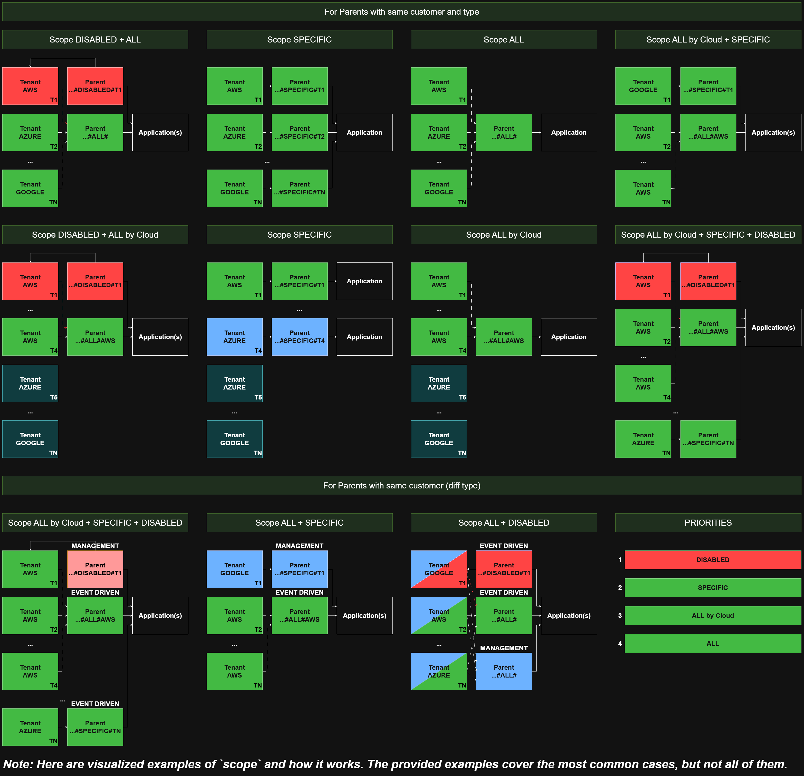

## Parent scopes

The following paragraph will explain technical details of the way tenants and parents can be linked together as well as DynamoDB queries that allow such behaviour. 

### Models

There are three types of entities we are talking about now: Applications, Parents and Tenants. 

- *Applications* represent access to third-party services, accounts, etc. They literally store access keys (safely) and some access metadata. 
- *Parents* represent some business logic (independently of other entities). It can seem abstract and vague first but it's quite flexible. Each parent has it's type that defines the logic this parent represents and also can contain some metadata with logic's specific settings. For example: we possibly could have a parent with type `CUSTODIAN_RULES_TO_EXCLUDE`. Such a parent would allow to store a list of rules in its meta which must be excluded. The business logic represented here is rules exclusion.
- Tenants represent cloud accounts. One tenant is one AWS Account, Azure Subscription, Google Project, etc.

### Relationships

#### Applications - Parents

One Parent can be linked to one Application and one Application can be linked to multiple parents. The relationship is 1:N, one Application to N Parents. Technically such a relationship is simple - we just keep application_id inside parent item.

#### Parents - Tenants

Basically, the relationship between Parents and Tenants is N:M. One Tenant can be linked to multiple Parents of different types and one Parent can be linked to multiple Tenants. In general, such behaviour can be achieved by adding a third table to store all the connections between entities, but in our case we achive this relationship without the third table. The solution is not that common so the explanation follows.

Imagine that we have **one** parent which represents some logic. From business perspective we should be able to handle such situations:

- a situation when we want to link that parent to **ONE** tenant. The logic that is represented by the parent is specific for that tenant;
- a situation when we want to link that parent to **ALL** the available tenants of a specific cloud (can be some system logic for that cloud);
- a situation when we want to link that parent to **ALL** the available tenants despite their cloud (some system logic for all clouds);
- a situation when we want to link that parent to **ALL** the available tenants **EXCEPT** some of them.

To sum up, if we abstract from the concept of Parents and just call it "business logic" (further BL) we must be able to enable this BL for one **SPECIFIC** tenant or for **ALL** tenants. Also we must be able to **DISABLE** this BL for some tenants. 

Now, let's move on to more technical details of the implementation. We add a new attribute named `s` (stands for `scope`) to Parents model. The value of this attribute is composed of three parts divided by `#` : https://aws.amazon.com/blogs/database/choosing-the-right-dynamodb-partition-key/. Each part must be present (though the last part can be empty in special cases) and TWO `#`must be present. Otherwise the attribute is not valid. Parts:

- parent type - duplicates Parent.type;
- parent scope - can be one of: **ALL**, **SPECIFIC**, **DISABLED**;
- parent tenant or cloud: tenant name in case parent's scope is **SPECIFIC** or **DISABLED**. If parent's scope is **ALL**, can be either empty or equal to some cloud (AWS, AZURE, GOOGLE, ...).
  **Note:** tenant name prefix could've been used (aws tenants' names start with `AWS-`, etc..), but we cannot be sure that tenant name format will not become uuid for example.

**Possible values of `s` attribute:**

- `BILLING#ALL# `: billing logic is enabled for all the tenant;
- `BILLING#DISABLED#EXAMPLE-TENANT-1`: biling logic is disabled for `EXAMPLE-TENANT-1` despite the fact that it is enabled by `BILLING#ALL#` (DISABLED has higher priority);
- `CUSTODIAN#SPECIFIC#EXAMPLE-TENANT-2`: custodian logic is enabled for `EXAMPLE-TENANT-2` ONLY.
- `SIEM_DEFECT_DOJO#ALL#AWS`: siem defect dojo logic is enabled for all AWS tenants.

**Priorities from higher to lower:**

- DISABLED
- SPECIFIC
- ALL + cloud
- ALL

**How to query:**

To be able to query this parents more or less efficiently we must create a DynamoDB index with hash_key=**cid** (customer id) and range_key=**s** (our new attribute). Now, parents have such a model

```python
{
 "pid": str,  # parent id, main hash_key
 "aid": str,  # application id 
 "cid": str,  # customer id, index hash_key
 "ct": int,  # creation date
 "d": bool,  # whether is deleted
 "meta": dict,  # type-bound meta
 "s": str,  # "type#scope#tenant|cloud", index range_key
 "t": str  # type
}
```

How we can query parents now:

- by parent_id

  **Operation:** GetItem

  **HashKey:** parent_id

  **RangeKeyCondition:** -

- by customer_id

  **Operation:** Query by cid-s-index

  **HashKey:** customer_id

  **RangeKeyCondition:** -

- by customer_id and type

  **Operation:** Query by cid-s-index

  **HashKey:** customer_id

  **RangeKeyCondition:** begins_with("[type]#")

- by customer_id and type and **DISABLED**/**SPECIFIC** scope

  **Operation:** Query by cid-s-index

  **HashKey:** customer_id

  **RangeKeyCondition:** begins_with("[type]#DISABLED") or begins_with("[type]#SPECIFIC")
  
  **Comment:** this query will retrieve all the tenants where logic with requested type is disabled/specific
  
- by customer_id and type, and **DISABLED**/**SPECIFIC** scope, and tenant_name

  **Operation:** Query by cid-s-index

  **HashKey:** customer_id

  **RangeKeyCondition:** begins_with("[type]#DISABLED#[tenant_name]") or begins_with("[type]#SPECIFIC#[tenant_name]")

  **Comment:** this query will retrieve the requested tenant where the logic with requested type is disabled/specific if such one exists
- by customer_id and type, and **ALL** scope

  **Operation:** Query by cid-s-index

  **HashKey:** customer_id

  **RangeKeyCondition:** "[type]#ALL#"

  **Comment:** this query will retrieve one parent with that type which is enabled for all the tenants (if such one exists)
- by customer_id and type, and **ALL** scope, and cloud

  **Operation:** Query by cid-s-index

  **HashKey:** customer_id

  **RangeKeyCondition:** "[type]#ALL#[cloud]"

  **Comment:** this query will retrieve one parent with that type which is enabled for all the tenants with specific cloud (if such one exists).

### Cases that it solves

In the following pseudocode:

- *tenant.customer* represents tenant's customer

- *tenant.scope* represents the value of 's' attribute

- *tenant.cloud* represents tenant's cloud

**Case 1**

We want to know if logic `BILLING` is enabled for tenant `EXAMPLE-TENANT-1`, and if enabled - retrieve its metadata, for example. Pseudocode:

```
Tenant tenant = Tenant.getItem(
    hashKey="EXAMPLE-TENANT-1"
);


Parent disabled = Parent.query(
    index="cid-s-index", 
    hashKey=tenant.customer, 
    range_key=Parent.scope.equal("BILLING#DISABLED#EXAMPLE-TENANT-1"),
    limit=1
)
if disabled:
		return 1;  # logic BILLING not enabled because it is explicitly disabled

Parent specific = Parent.query(
    index="cid-s-index", 
    hashKey=tenant.customer, 
    range_key=Parent.scope.equal("BILLING#SPECIFIC#EXAMPLE-TENANT-1"),
    limit=1
)
if specific:
		return specific;  # parent with type BILLING is specifically created for tenant. Returning it

Parent allForCloud = Parent.query(
    index="cid-s-index", 
    hashKey=tenant.customer, 
    range_key=Parent.scope.equal("BILLING#ALL#" + tenant.cloud),
    limit=1
)
if allForCloud:
		return allForCloud;  # parent with type ALL for tenant's cloud is found

Parent all = Parent.query(
    index="cid-s-index", 
    hashKey=tenant.customer, 
    range_key=Parent.scope.equal("BILLING#ALL#"),
    limit=1
)
if all:
		return all;  # logic is enabled for all
return 1;  # nothing found. Logic not enabled for that tenant.
```

**Case 2**

Temporarily omitted, will be revisited in the future


### Parent Scope Visualized Examples


